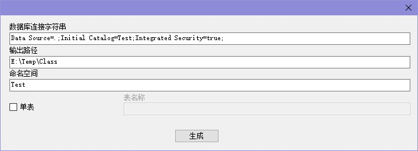
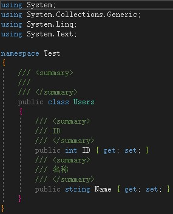
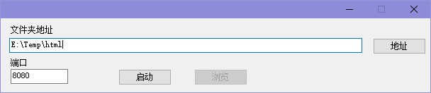

# 工具箱

## 描述

|名称 |描述 |版本 |
| -  | -   | -   |
| DatabaseModelGenerator | 数据库模型生成器(仅支持 Microsoft SQL Server) |V 1.0|
| DemoHttpServer | http示例服务器(仅支持部分静态网页文件) |V 1.0 |

## 界面截图

#### DatabaseModelGenerator

 
生成示例 

 

#### DemoHttpServer

 
示例 
